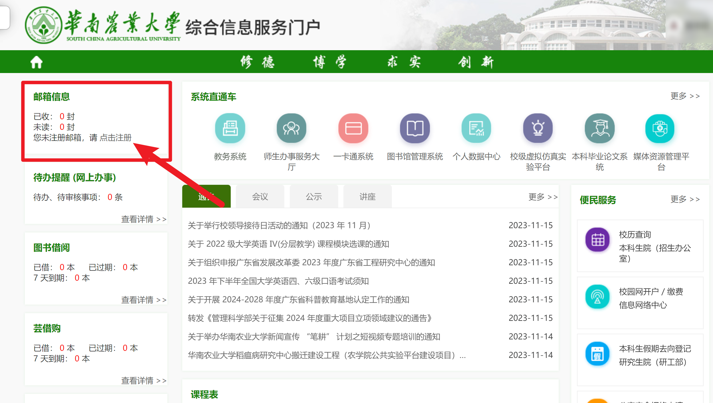
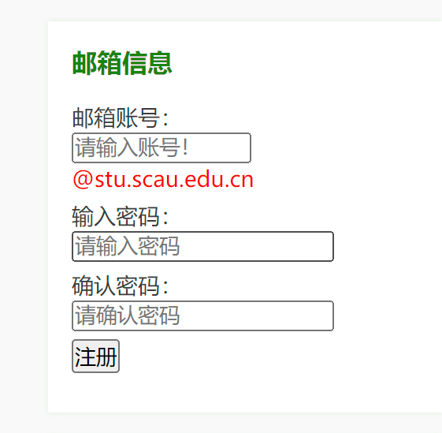
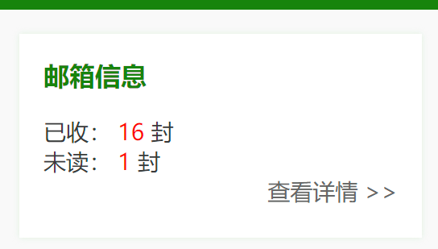
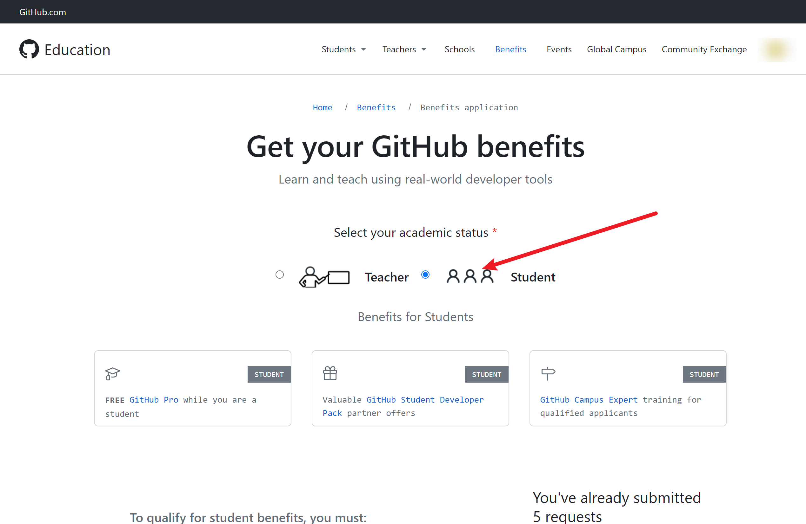
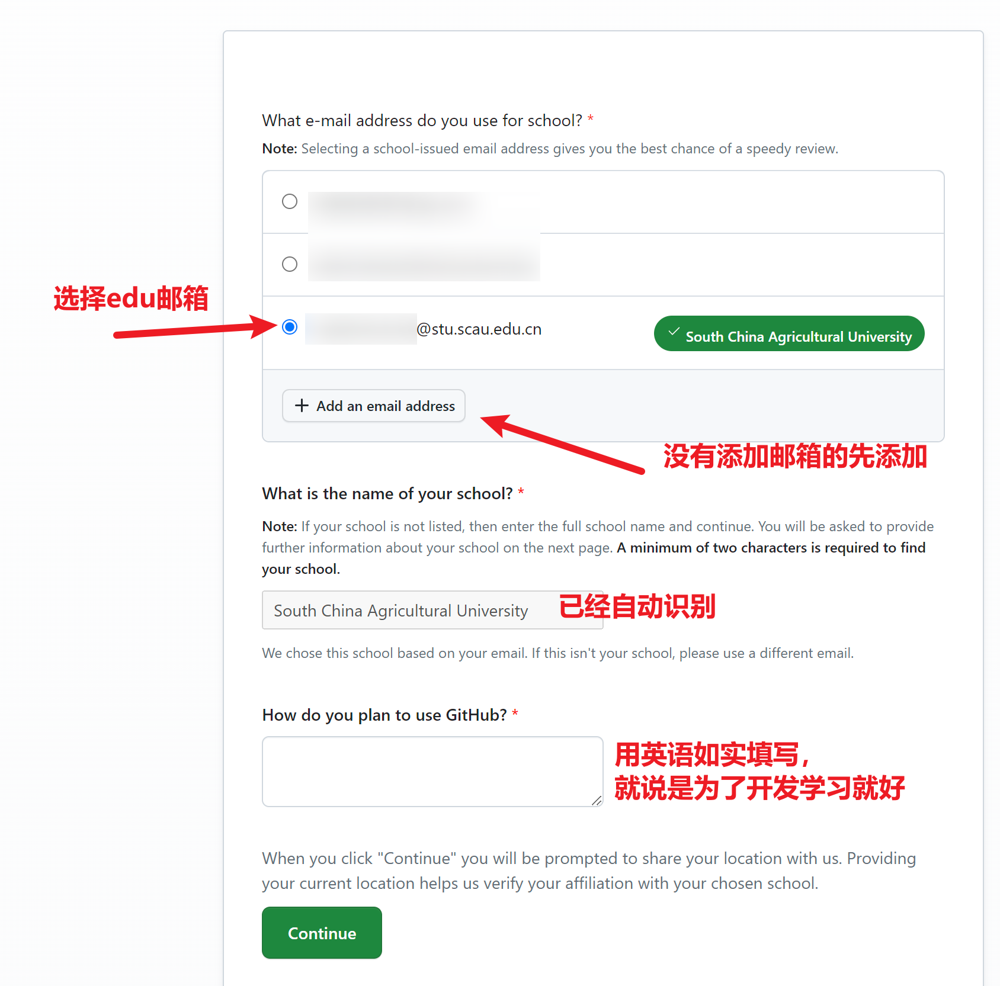
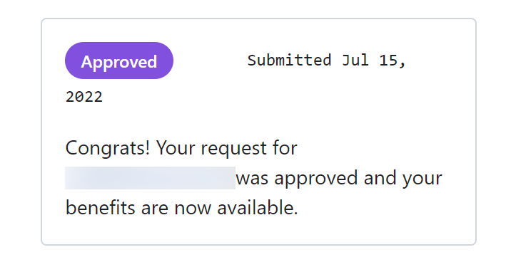
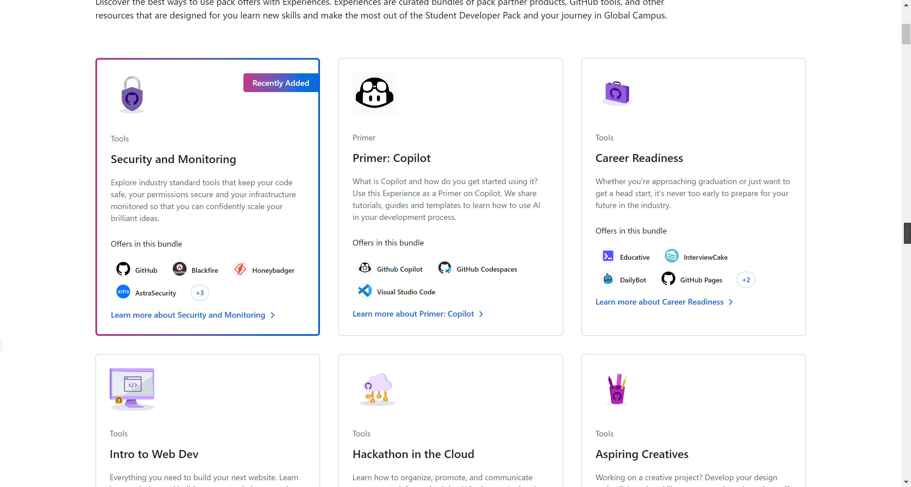

# 申请GitHub Student Pack教育优惠
### 导言
我们都知道，GitHub的学生包里包含着很多免费好用的资源，

从免费域名到免费服务器，还有各种IDE以及软件的高级版等，

而这些都只需要一个edu邮箱即可申请！

跟随下面的步骤，教你如何获取SCAU的edu邮箱，再申请GitHub Student Pack教育优惠。
## 获取SCAU的EDU邮箱
### 1.登录信息门户
信息门户的网址是：[https://portal.scau.edu.cn/](https://portal.scau.edu.cn/)，

用自己的学号以及密码登陆之后，左上角便是我们的邮箱注册入口（如图）

### 2.注册邮箱
点击邮箱注册入口，进入邮箱注册流程(如图)

此处的账号经过多方咨询后得到的回复是没有硬性要求（不同学院可能有不同要求，建议先问一下学长，数信好像没有要求），

密码设置自己的常用密码即可，完成后点击“注册”即可。

### 3.登录邮箱

注册完成后，以后每次登录信息门户即可进入邮箱，

点击“查看详情”即可进入邮箱界面（如图）

**至此，我们的edu邮箱已经注册完成，接下来就是申请GitHub Student Pack教育优惠了**

---

## 申请GitHub Student Pack教育优惠

### 1.注册登录GitHub

对于没有GitHub账号的同学，可以先注册一个GitHub账号，

> 注：由于懂得都懂的原因，请自行解决网络问题，本文不提供具体方法。

GitHub的注册地址是：[https://www.github.com](https://www.github.com)，关于GitHub的注册，这里就不再赘述了。

### 2.申请GitHub Student Pack

登录 GitHub 后，打开 [https://education.github.com/discount_requests/application](https://education.github.com/discount_requests/application) 即可进入 GitHub Student Pack 教育优惠申请页面，如图

我们选择 “Student”，然后往下滚动，按照下图进行填写操作

完成填写后点击“Continue”，之后就会有通过验证的邮件发送给你。

当你刷新页面后看到右侧有如下图的提示时，说明你已经申请成功了。

接下来，我们就可以享受GitHub Student Pack教育优惠了。

在[https://education.github.com/pack](https://education.github.com/pack)可以看到我们可以享受的优惠，如图

Enjoy it！感谢你的耐心阅读。